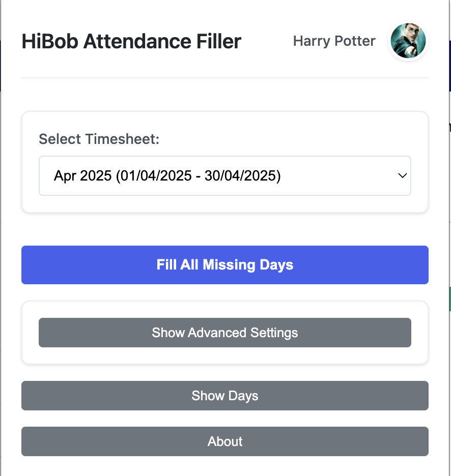

# HiBob Attendance Filler Chrome Extension

This Chrome extension helps you automatically fill missing attendance in HiBob with ease.

> **Disclaimer:** This is a third-party tool and is not affiliated with, endorsed by, or connected to HiBob in any way. This is an unofficial extension created by independent developers.

## Features

- **View Missing Days**: Quickly see all days with missing attendance.
- **Fill Individual Days**: Fill attendance for specific days with a single click.
- **Fill All Days**: Automatically fill all missing days at once.
- **Customizable Work Hours**: Set your preferred start and end times.
- **Smart Skipping**: Automatically skips holidays, weekends, and approved time off.

## Installation

1. **Download or Clone**: Get this repository on your local machine.
2. **Open Chrome Extensions**: Go to `chrome://extensions/` in your Chrome browser.
3. **Enable Developer Mode**: Toggle the switch in the top right corner.
4. **Load Unpacked**: Click "Load unpacked" and select the directory where you downloaded the extension.

## Usage

1. **Log In to HiBob**: Visit [HiBob](https://app.hibob.com) and log in.
2. **Open the Extension**: Click the HiBob Attendance Filler icon in your Chrome toolbar.
3. **Select Timesheet**: Choose the timesheet you want to fill.
4. **Fill Attendance**:
   - Click "Fill" next to individual days to fill them one by one.
   - Click "Fill All Missing Days" to fill all missing days at once.

## Notes

- **Default Hours**: The extension fills attendance with default hours from 9:00 to 18:00.
- **Automatic Skipping**: It skips:
  - Weekends
  - Holidays
  - Non-working days
  - Days with approved time off (vacation, sick days, etc.)
  - Days that already have attendance entries
- **Not an Official HiBob Product**: This extension is developed independently and is not associated with or supported by HiBob.

## Development

The extension consists of:
- `manifest.json` - Extension configuration
- `popup.html` - Extension popup UI
- `popup.js` - Popup logic
- `content.js` - Content script for interacting with HiBob
- `background.js` - Background script

## Icons

Enjoy seamless attendance management with HiBob Attendance Filler!